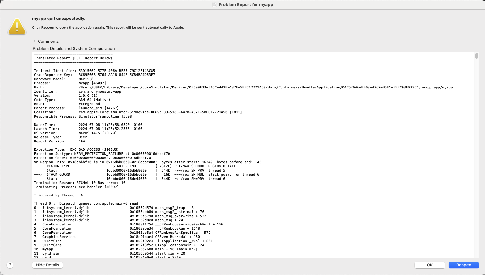

# React Native Form Data Issue

There appears to be an issue with react native when sending [formdata](https://developer.mozilla.org/en-US/docs/Web/API/FormData) as part of an api request on IOS physical devices and simulators.

There is a previous closed issue with no solution provided [here](https://github.com/facebook/react-native/issues/37268)

The issue only appears when the formdata object has over ___ keys.

This repo has been created to reproduce the issue. A single button has been added to the home screen which will cause the crash.

## Reproduction Steps

You must be able to run the app on an IOS simulator of physical device so a Mac will be required.

- clone repo
- install node.js (18.20.2)
- run `npm i` to install dependencies from repo root folder.
- follow expo setup for ios devices [here](https://docs.expo.dev/get-started/set-up-your-environment/?platform=ios&device=simulated&mode=development-build&buildEnv=local)
- run ios app `npm run ios`
- Click only button on home screen
- App will crash
- Try different `numberOfKeyValuePairs` values in `index.tsx` to see if crash will happen.

## Error Report Example

